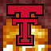

#  TTU Custom Server Resources

These are the custom resources for the TTU server. It includes various features and enhancements to improve gameplay and provide a unique experience for players as well as the textures to help support it.

## Datapack

The pack is made up of several modules, each providing different functionalities. Below is a list of the available modules and the information about them.

### DiscSwapper

This module is specifically designed to pair with the audioplayer mod by letting the player use any disc model the want for their custom music discs.

`/function discswapper:menu` or `/trigger discmenu`: Shows a custom dialog menu for swapping music discs.

`/function discswapper:menu_alt` or `/trigger discmenu set 2`: Shows an alternative text-based menu for swapping music discs.

`/trigger discmodel set <number>`: Changes the model of the music disc to the specified number.

### Mannequin

The players are not generated automatically. They are manually added to the datapack. For new players you have to change a bunch of stuff. These are also not real players, they are just mannequins that look like players. The mannequins are spawned on bats that are named after the players. When they first spawn in, they look at the nearest player and the bat is killed.

`/function mannequin:give_eggs`: Gives the player all the spawn eggs for the players.

`/function mannequin:give_heads`: Gives the player all the heads for the players.

`/function mannequin:spawn_players_arranged`: Spawns all the players arranged like they are on stairs.

`/function mannequin:spawn_players`: Spawns all players and spreads them out randomly

### SpawnRadius

This doesn't add spawn protection, but it notifies players when they leave the spawn area in case your server has rules about griefing or PvP in the spawn area.

`/function spawnradius:config`: Shows a custom dialog menu for configuring the spawn radius settings.

`/function spawnradius:set_spawn`: Sets the spawn to the current location of the player.

`/function spawnradius:set_radius {radius:<number>}`: Sets the spawn radius to the specified number.

`/function spawnradius:set_shape {shape:<sphere|square>}`: Sets the shape of the spawn radius to either circle or square.

`/function spawnradius:set_config {shape:<sphere|square>, radius:<number>}`: Sets both the shape and radius of the spawn radius at once.

`/function spawnradius:info`: Shows info about the current spawn radius and shape in chat.

## Resource Pack

Nothing has been added to the resource pack yet, so it is not required yet.

## Developing

If you are interested in contributing to the development of these custom resources, please feel free to fork the repository and submit a pull request with your changes.

To setup your environment for development, you will need to do the following:

1. Fork the repository on GitHub to your own account.
2. Clone the repository to your local machine using the command: `git clone <repository_url>`
3. Create 2 Symlinks
   1. Create a symlink from the `datapack` folder to your Minecraft `saves/<world_name>/datapacks` folder.
   2. Create a symlink from the `resourcepack` folder to your Minecraft `resourcepacks` folder.
4. Enable Symlinks in your Minecraft instance
   1. In you `.minecraft` folder, create a file called `allowed_symlinks.txt` and add the paths to the `datapack` and `resourcepack` folders in the repository.

To push a new release of the repository, you will need to do the following:

1. Run `git tag v<version_number>` to create a new tag for the release.
2. Run `git push origin v<version_number>` to push the tag to the remote repository.

## Help?

- [Datapack Wiki Page](https://minecraft.wiki/w/Data_pack)
- [Resource Pack Wiki Page](https://minecraft.wiki/w/Resource_pack)

## Credits

- [BenGamer427](https://github.com/HoleInOneGolfer)
